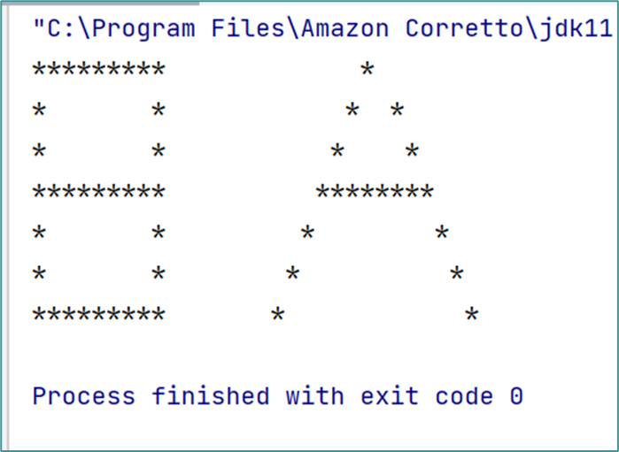

**1η Άσκηση**

Γράψτε ένα πρόγραμμα, νέα κλάση με όνομα MenuApp μέσα στο package gr.aueb.gr.ch1, που να εκτυπώνει το παρακάτω Μενού (χωρίς το κόκκινο πλαίσιο):

Επιλέξτε μία από τις παρακάτω επιλογές:
1. Εισαγωγή
2. Διαγραφή
3. Αναζήτηση
4. Ενημέρωση
5. Έξοδος  
   Δώστε αριθμό επιλογής:

**2η Άσκηση**  
Γράψτε μία κλάση με όνομα InitialsApp μέσα στο package gr.aueb.cf.ch1, που να εκτυπώνει τα αρχικά του ονόματός σας με κεφαλαία γράμματα, με αστεράκια, π.χ.  

**3η Άσκηση**  
Γράψτε ένα πρόγραμμα που δηλώνει δύο μεταβλητές ακεραίων num1 και num2 και αποθηκεύει το αποτέλεσμα της πρόσθεσης num1 + num2 στην μεταβλητή sum. Στη συνέχεια εκτυπώνει με println το εξής κείμενο: Το αποτέλεσμα της πρόσθεσης είναι ίσο με [το αποτέλεσμα της πρόσθεσης]  

Δοκιμαστικά Δεδομένα: 
num1 = 19 και num2 = 30  
Αναμενόμενα Αποτέλεσμα: 49
