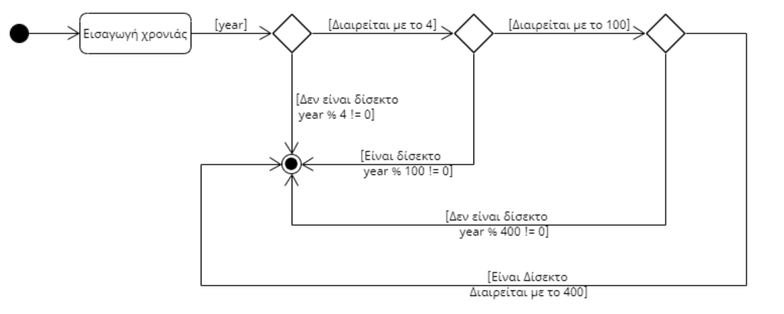

1. **Για να αναλύετε μία διαδικασία μπορείτε**: 1) να χρησιμοποιείται Παραδείγματα Χρήσης (ΠΧ) (Use Cases), και 2) για διαγραμματική απεικόνιση μπορείτε να χρησιμοποιείτε Activity Diagrams
   
**ΠΧ1 - Έλεγχος αν ένα έτος είναι δίσεκτο**
**Πρωτεύων Actor:** Χρήστης Εφαρμογής  

**Βασική Ροή:**  

1. Ο Χρήστης εισάγει το έτος
2. Η εφαρμογή ελέγχει αν το έτος διαιρείται με το 4.  
   [Εναλλακτική ροή 2α: Το έτος δεν διαιρείται με το 4]  
   1. Η εφαρμογή εμφανίζει μήνυμα "Δεν είναι δίσεκτο"
   2. Η εφαρμογή τερματίζει
3. Η εφαρμογή ελέγχει αν το έτος διαιρείται με το 100.  
   [Εναλλακτική ροή 3α: Το έτος δεν διαιρείται με το 100]
   1. Η εφαρμογή εμφανίζει μήνυμα "Είναι δίσεκτο"
   2. Η εφαρμογή τερματίζει
4. Η εφαρμογή ελέγχει αν το έτος διαιρείται με το 400.  
   [Εναλλακτική ροή 4α: Το έτος δεν διαιρείται με το 400]
   1. Η εφαρμογή εμφανίζει μήνυμα "Δεν είναι δίσεκτο"
   2. Η εφαρμογή τερματίζει
5. Η εφαρμογή εμφανίζει μήνυμα "Είναι δίσεκτο"
6. Η εφαρμογή τερματίζει

**Activity Diagram**  
Τα Activity Diagrams είναι μηχανές καταστάσεων (State Machines) που αποτελούνται από ένα κόμβο έναρξης, ένα κόμβο τερματισμού, ενδιάμεσες καταστάσεις και μεταβάσεις μεταξύ καταστάσεων με βάση δεδομένα.
Επίσης, περιλαμβάνουν κόμβους απόφασης. Ξεκινούν από μία αρχική κατάσταση (solid circle)
και με βάση τα δεδομένα που λαμβάνουν μεταβαίνουν σε μία νέα κατάσταση (οι καταστάσεις επιτελούν λειτουργίες της εφαρμογής
και απεικονίζονται με παραλληλόγραμμα). Μεταξύ καταστάσεων μπορεί να υπάρχουν κόμβοι απόφασης που απεικονίζονται με ρόμβους
και οδηγούν σε branches ανάλογα με τον έλεγχο (δεδομένα και έλεγχοι μπορούν να απεικονίζονται ως κείμενο στις ροές).
Τελικά, θα πρέπει να υπάρχουν μία ή περισσότερες διαδρομές που να οδηγούν σε ένα end-node (απεικονίζεται με διπλό κύκλο).  

Στην παρούσα εφαρμογή ελέγχου αν ένα έτος είναι δίσεκτο ή όχι, το Activity Diagram είναι το παρακάτω: 

